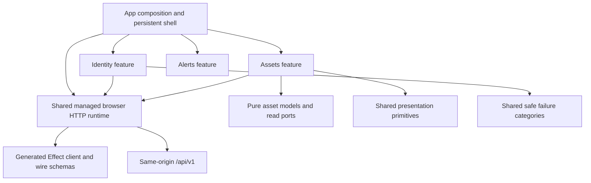

# Architecture

## TL;DR

FleetIQ UX is a SolidJS web console. App composition owns routing and one managed
Effect v4 HTTP runtime. Independent features own pure models, validated adapters,
and reactive presentation. Operator sessions gate the connected catalogue,
inspector, and registry. Explicit development previews remain separate from
production evidence.

## Boundaries

- `apps/web/src/app`: persistent layout, route gates, runtime/provider composition.
- `features/<capability>/model`: pure values, read ports, URL and projection rules.
- `features/<capability>/api`: validated transport adapters and Effect workflows.
- `features/<capability>/ui`: resource-owning controllers and focused presentation.
- `shared/api`: product-neutral managed HTTP runtime and transport failure mapping.
- `shared/model`: product-neutral failure values with no transport dependencies.
- `shared/ui`: presentation primitives; `design-system` owns semantic CSS tokens.
- `generated`: deterministic output of the pinned backend-owned OpenAPI bundle.
- `apps/web-e2e`: page objects, test-only HTTP fixtures, browser journeys and narration.
- `tools`: repository checks, contract generation, and user-guide assembly.

Models never import transport, generated wire schemas, UI, or app composition.
Features do not import one another. The app injects the assets reader and a session
invalidation callback; assets need no identity implementation import. App and
shared consumers use deliberate public barrels and the package import map.
Internal files import siblings directly to avoid barrel cycles.

Dependency-cruiser enforces inward direction, public entries, unresolved imports,
and cycles. Biome enforces selected Solid rules and excludes Effect imports from
presentation TSX. The view gate limits route/page orchestrators to 150 production
lines. Review still assesses responsibility, reactivity, scope, and visual hierarchy.
See the [frontend structure guide](docs/development/frontend-structure.md).

## State and lifetimes

The URL owns tenant, current-page filters, selection, review cutoffs, and independent
catalogue/relationship/target/source cursors. Solid memos derive view state; child
components own local interaction. Resource controllers clear superseded evidence,
abort on scope change/unmount, and ignore late results even if an adapter ignores
cancellation. No snapshot cache or automatic retry policy is introduced.

App composition creates one browser runtime for session and metadata adapters;
cleanup disposes it and interrupts work. Generated Effect programs run only through
that runtime, with scopes, a bounded response body, and a whole-operation timeout.
The feature-facing ports remain `Promise` plus `AbortSignal`, allowing independent
Solid controller tests without coupling presentation to Effect.

Identity owns session inspection, focus refresh, expiry, sign-in return context,
and logout. Metadata 401 invalidates the session and unmounts protected evidence.
Logout hides evidence immediately and reports failure without claiming revocation.
Provider tokens and workload secrets never reach JavaScript. Backend authorization
is authoritative on every request; a successful session does not imply tenant access.
See [ADR 0004](docs/design-docs/0004-browser-safe-semantic-metadata.md).

## Contract and evidence

The [pinned HTTP contract](contracts/http/README.md) provides bounded identities,
exact definition versions, directed relationships, exact source/target bindings,
and browser sessions. Generated schemas validate shape. Maintained adapter checks
validate request scope, safe integer times, versions, decimal revisions, effective
intervals, page size, uniqueness, and advancing cursors.

The connected registry is a temporal metadata review, not a complete graph or a
source inventory. Multiple reads share explicit cutoffs but do not promise one
database snapshot. Asset identity and definition reads are current immutable
metadata; the historical cutoffs apply to relationships and bindings.

## Visual foundation and remaining capabilities

The [visual-language decision](docs/design-docs/0001-operational-visual-language.md)
and [shell decision](docs/design-docs/0002-persistent-shell-theme.md) govern the
persistent frame, dense panels, responsive grids, and semantic light/dark themes.
Connected screens use the same hierarchy with honest unavailable operational data.

Local Vite development retains the labelled sample overview, schematic map, asset
inspector, finite signal playback, registry, and alert triage. These fixtures are
separate from backend models and excluded from production output. The map uses
percentage canvas positions, not observed geography. No production property state,
telemetry stream, geodetic map SDK, tiles, alert lifecycle, or native mobile app
exists yet. Introduce Effect Atom only with an actual shared granular-state need.

[FRONTEND.md](docs/FRONTEND.md) details the selected stack;
[PLANS.md](docs/PLANS.md) records sequencing and acceptance evidence.

Protected component ownership is keyed by the authenticated actor ID. A focus
refresh that discovers a different account disposes the previous account's reads
and metadata before mounting the new account's views; same-actor expiry refresh
preserves ordinary interaction. Native sign-in anchors opt out of Solid Router
with `rel="external noreferrer"` so the server receives the login request.
